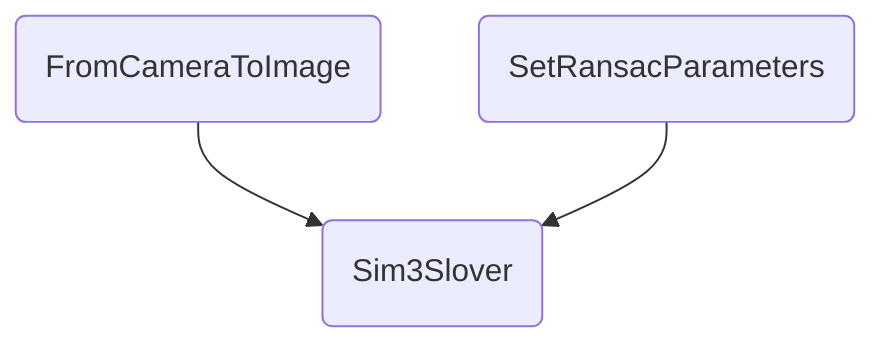

## Sim3solver.cpp文件的流程图

```flow
st=>start: Start
op1=>operation: Sim3Slover
op2=>operation: SetRansacParameters
op3=>operation: iterate

op4=>operation: ComputeCentroid
op5=>operation: ComputeSim3
op6=>operation: CheckInliers
op7=>operation: Project
op8=>operation: FromCameraToImage
e=>end

st->e
```



#### Sim3Solver()
1. 根据vpMatched12配对比配的MapPoint： pMP1和pMP2
2. 计算允许的重投影误差阈值：mvnMaxError1和mvnMaxError2
2.1. 找到匹配点对应的索引
2.2. 去除匹配特征点的引用
2.3. 根据尺度计算对应的误差阈值
3. 将MapPoint从世界坐标系变换到相机坐标系：mvX3Dc1和mvX3Dc2

#### iterate()
1. 任意取三组点(匹配的3D点对)计算Sim矩阵
2. 根据两组匹配的3D点,计算之间的Sim3变换 ComputeSim3(P3Dc1i,P3Dc2i)
3. 根据投影误差进行inlier检测 CheckInliers()

#### ComputeSim3()

## LoopClosing::ComputeSim3
对每一个候选关键帧都尝试计算Sim3,构造Sim3求解器的vector
1. 取出当前候选关键帧pKF
2. 将当前帧mpCurrentKF与闭环候选关键帧pKF匹配
2.1. 剔除匹配点数太少的候选关键帧
2.2. 构造sim3求解器,配置RANSAC参数
2.3. 遍历所有候选关键帧,并将需要计算的求解器插入vector中
3. 对上述有较好匹配的候选帧与当前帧计算sim3变换,最多迭代5次
3.1. 迭代5次仍未求出合适的sim3变换,则剔除
4. 通过步骤3求取的sim3变换引导匹配关键帧,弥补步骤2中的漏匹配
4.1. 之前使用SearchByBoW会存在漏匹配
4.2. 通过sim3能够得到匹配特征点的大致区域
4.3. 在特征点对应的大致区域内再次进行匹配,捕获漏匹配点
5. sim3优化,只要有一个候选关键帧通过求解与优化,就停止其他帧的判断
5.1. 构造g2o优化sim3
6. 取出与闭环匹配上的关键帧mpMatchedKF相连的关键帧以及mappoints
6.1. 将mpMatchedKF相连的关键帧全部取出来放入vpLoopConnectedKFs
6.2. 将vpLoopConnectedKFs的MapPoints取出来放入mvpLoopMapPoints
7. 将闭环匹配上关键帧以及相连关键帧的MapPoints投影到当前关键帧进行投影匹配
7.1. 根据投影匹配查找更多的匹配点
7.2. 根据sim3变换,将相连的关键帧投影到当前关键帧中,确定一个搜索区域
7.3. 根据该点的描述子与搜索区域内的特征点进行匹配,以增加匹配点数
8. 判断当前帧与检测出的所有闭环关键帧是否有足够多的匹配点数
9. 清空清空mvpEnoughConsistentCandidates